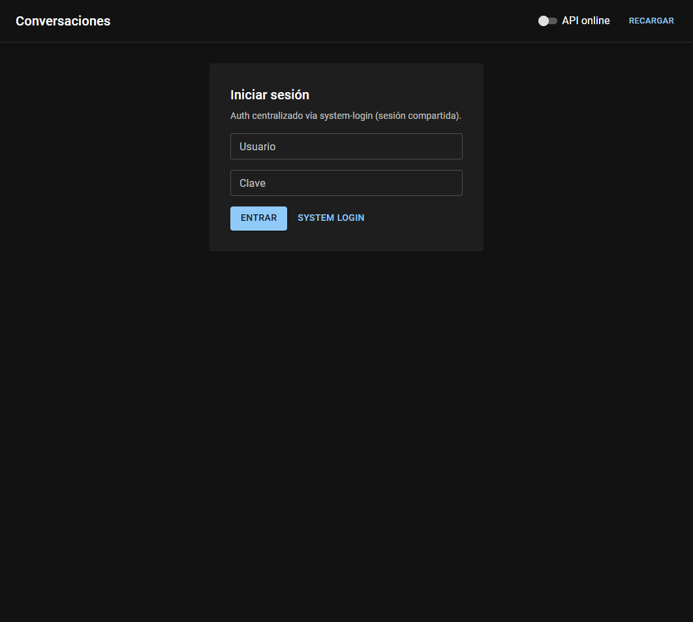

<p align="center">
  
</p>

<h1 align="center">conversations-front</h1>

<p align="center"><strong>Explorador de conversaciones PatyIA</strong> — hilos, mensajes e instrucciones IA.</p>

[](https://jeff-aporta.github.io/conversations-front/)
[](https://react.dev/)

## Demo

**https://jeff-aporta.github.io/conversations-front/**

## Vista previa



## Qué hace

- **Lista / detalle** de conversaciones persistidas
- **Login** antes de consultar datos
- **Recarga manual** y modo local o producción
- Layout de dos paneles (lista + detalle) con scroll contenido

Icono: `mdi:forum-outline` · tema `#6a1b9a`

## Vista local

```bash
npx serve .
```

MIT · [Jeff-Aporta](https://github.com/Jeff-Aporta)
