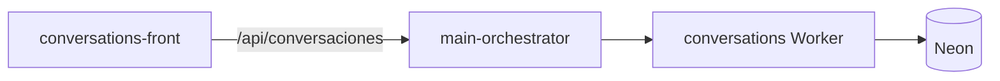

<p align="center">
  
</p>

<h1 align="center">conversations-front</h1>

<p align="center"><strong>Explorador de conversaciones PatyIA</strong> — hilos persistidos en Neon, detalle de mensajes e instrucciones IA.</p>

## Arquitectura



[](https://jeff-aporta.github.io/conversations-front/)
[](https://react.dev/)
[](https://github.com/Jeff-Aporta/conversations-back)
[](https://neon.tech/)

## Demo

**https://jeff-aporta.github.io/conversations-front/**

## Vista previa


## Qué hace

- **Lista / detalle** de conversaciones almacenadas en PostgreSQL (Neon).
- **LoginGate** con JWT de system-login antes de consultar datos.
- **Recarga manual** y switch **orquestador local :8780 / producción**.
- Layout de dos paneles (lista + detalle) con scroll contenido.

## Metadatos

Icono: `mdi:forum-outline` · tema `#6a1b9a` · [`JeffAppMeta`](https://github.com/Jeff-Aporta/front-shared/blob/main/cdn/isa/js/core/app-meta.js).

## Desarrollo local

```bash
npx serve .
# main-orchestrator en :8780
```

## Repos relacionados

| Repo | Rol |
|------|-----|
| [conversations-back](https://github.com/Jeff-Aporta/conversations-back) | API conversaciones (Worker) |
| [conversations-front](https://github.com/Jeff-Aporta/conversations-front) | Este panel (GH Pages) |

MIT · [Jeff-Aporta](https://github.com/Jeff-Aporta)
